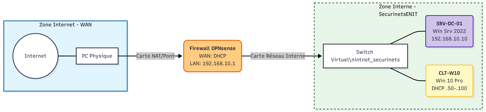

# 1. Fundamental Concepts of Active Directory

## 1.1 What is Active Directory (AD)?
Active Directory (AD) is a directory service developed by Microsoft for Windows network environments. It is a distributed, hierarchical structure that allows for the centralized management of an organization's resources, including users, computers, groups, network devices, file shares, and policies.

**Why is it Critical?**
* **Centralization:** It provides authentication and authorization functions within a Windows domain.
* **Ubiquity:** It is estimated that around **95% of Fortune 500 companies** run Active Directory.
* **Security Risk:** AD is a key focus for attackers. It acts as a large, often read-only database accessible to all users. A standard user can enumerate most objects to find misconfigurations, making it a critical component for lateral movement and privilege escalation (e.g., Ransomware, APTs).

## 1.2 Logical Structure
Active Directory is arranged in a hierarchical tree structure:


* **Forest:** The topmost container and security boundary. It collects one or more AD domains that share a common schema and global catalog.
* **Tree:** A collection of domains that share a contiguous namespace (e.g., `inlanefreight.local` and `corp.inlanefreight.local`).
* **Domain:** A logical group of objects (users, computers, OUs). It acts as a management boundary.
* **Organizational Units (OU):** Containers within a domain used to organize objects and apply Group Policy Objects (GPOs).

## 1.3 Key Terminology
To understand AD administration and attacks, the following terms are essential:

### Objects and Identifiers
* **Object:** Any resource present within the AD environment (User, Printer, Domain Controller).
* **Schema:** The blueprint of the environment. It defines what types of objects can exist (classes) and their associated characteristics (attributes).
* **GUID (Global Unique Identifier):** A unique 128-bit value assigned at creation. It is immutable (never changes), even if the object is renamed or moved.
* **SID (Security Identifier):** A unique identifier used to manage permissions. Unlike the GUID, a SID can change (though rarely), and AD maintains a history (`sIDHistory`).
* **Distinguished Name (DN):** The full path to an object (e.g., `CN=bjones,OU=IT,DC=inlanefreight,DC=local`).

### Infrastructure Roles
* **Domain Controller (DC):** A server that stores the AD database and handles authentication requests.
* **Global Catalog (GC):** A specific DC that stores a full copy of all objects in its domain and a partial, read-only copy of all objects in the entire forest. It is used for forest-wide searches.
* **FSMO Roles (Flexible Single Master Operation):** Five specific roles assigned to DCs to handle critical changes and prevent conflicts (e.g., Schema Master, RID Master, PDC Emulator).
* **RODC (Read-Only Domain Controller):** A DC with a read-only database, used in locations where physical security cannot be guaranteed. It does not cache administrator passwords.

## 1.4 Security and Management Mechanisms
* **Group Policy Object (GPO):** A virtual collection of policy settings (security configurations, software installation, scripts) applied to users and computers.
* **Access Control List (ACL):** An ordered list of permissions attached to an object.
    * **DACL (Discretionary ACL):** Defines who is granted or denied access.
    * **SACL (System ACL):** Defines which access attempts are audited (logged).
* **Service Principal Name (SPN):** A unique identifier for a service instance. SPNs are critical for **Kerberos** authentication and are often targeted in "Kerberoasting" attacks.
* **Replication:** The process of synchronizing AD objects and changes between Domain Controllers to ensure data consistency across the network.
---
# 2. Design and Architecture

This chapter details the technical and structural choices made to build the *SecurinetsENIT* infrastructure. The architecture is designed to simulate a realistic corporate environment, strictly segmented and secured.

## 2.1 Virtualized Network Topology

The infrastructure relies on the **VirtualBox** hypervisor (Type 2). It is segmented into two distinct zones to ensure laboratory isolation and security:


* **WAN Zone (External):** Simulates Internet access via a NAT/Bridged interface. It represents the untrusted public network.
* **LAN Zone (Internal):** A strictly isolated private network, configured on the custom virtual switch `LAN_securinets`. This is where critical services (AD, SOC) and client workstations reside.

Traffic between these two zones is strictly controlled by the **OPNsense** virtual machine, which acts as the default gateway and perimeter firewall.


> *Figure 2.1 – Global network architecture and communication flows.*

## 2.2 Virtual Machine Hardware Specifications

To ensure optimal performance and stability within the host environment, the virtual machines have been provisioned with the following hardware resources:

| Virtual Machine | Operating System | vCPU | RAM | Storage | Network Interfaces |
| :--- | :--- | :--- | :--- | :--- | :--- |
| **FW-OPN-01** (Firewall) | **OPNsense** (FreeBSD) | 2 | 2 GB | 20 GB | **NIC 1:** WAN (NAT/Bridge)<br>**NIC 2:** LAN (`LAN_securinets`) |
| **SRV-DC-01** (Server) | **Windows Server 2022** | 2 | 4 GB | 60 GB | **NIC 1:** LAN (`LAN_securinets`) |
| **CLT-W10** (Client) | **Windows 10 Pro** | 2 | 4 GB | 50 GB | **NIC 1:** LAN (`LAN_securinets`) |

> **Note:** The RAM and vCPU allocation can be adjusted based on the physical host's available resources, but the specifications above are recommended for a smooth simulation of Active Directory services.

## 2.3 IP Addressing Plan

To ensure consistent and scalable network management, a static addressing plan has been defined for the LAN segment `192.168.10.0/24`.

**Table 2.2 – SecurinetsENIT Network Addressing**

| Hostname | Role | IP Address (LAN) | Notes |
| :--- | :--- | :--- | :--- |
| **FW-OPN-01** | Gateway / Firewall | `192.168.10.1` | Default Gateway for the LAN. |
| **SRV-DC-01** | Domain Controller | `192.168.10.10` | Primary DNS and Auth Server. |
| **CLT-W10** | Client Workstation | `192.168.10.10` | Simulates end-user activity. |
---
# 3. Phase 1 Implementation: Setup and Connectivity

This phase focuses on building the virtual foundation of the laboratory. The objective is to establish a functional, isolated network where machines can communicate with each other while being protected by the firewall.

## 3.1 Hypervisor Network Configuration

Before deploying any Virtual Machines (VMs), we configured the virtual switching environment within **Oracle VirtualBox** to create a true "Air-Gapped" internal network.


**Step-by-Step Configuration:**
1.  **Internal Network Creation:** Instead of using the default "NAT Network", we manually typed `intnet_securinets` in the "Internal Network" name field for the network adapters of the DC and Client.
2.  **Isolation Verification:** This configuration ensures that no traffic from the LAN can reach the physical host or the Internet without passing through the OPNsense router.

## 3.2 Virtual Machine Deployment

### A. Perimeter Firewall (FW-OPN-01)
The firewall is the critical node connecting the WAN and LAN.


1.  **Installation:** We booted the OPNsense ISO and performed a standard installation on the virtual disk (UFS filesystem).
2.  **Interface Assignment:** Upon the first boot, the console prompted to assign interfaces. We mapped them based on MAC addresses:
    * `em0` (WAN) $\rightarrow$ Assigned to the adapter in **NAT** mode (receives IP from VirtualBox DHCP).
    * `em1` (LAN) $\rightarrow$ Assigned to the adapter in **Internal Network** mode.
3.  **IP Configuration:** We statically assigned the LAN IP to `192.168.10.1` and validated the assignment in the console.


> *Figure 3.1 – OPNsense console showing correct WAN and LAN IP assignments.*

### B. Domain Controller (SRV-DC-01)
This server will become the heart of the Active Directory.


1.  **OS Installation:** We installed **Windows Server 2022 Standard (Desktop Experience)**.
2.  **Network Configuration (Static):**
    * **IP Address:** `192.168.10.10`
    * **Default Gateway:** `192.168.10.1`
    * **DNS Server:** `127.0.0.1`

### C. Client Workstation (CLT-W10)
This machine simulates a standard employee laptop.

1.  **OS Installation:** Deployment of **Windows 10 Pro**.
2.  **Network Configuration:**
    * Validated DHCP reception from OPNsense.
    * **Critical Step:** Manually set the **Preferred DNS Server** to `192.168.10.10`.

## 3.3 Connectivity Testing & Validation

To conclude Phase 1, we performed connectivity tests to validate the architecture.

### Test 1: Internal Connectivity (East-West)
**Goal:** Verify that the Client can reach the future Domain Controller via the virtual switch.
* **Source:** CLT-W10
* **Destination:** `192.168.10.10`
* **Result:** Successful.


> *Figure 3.2 – Successful ping from Client to the Server IP.*

---

### Test 2: Routing to Gateway (North-South)
**Goal:** Verify that the Server can reach the OPNsense Firewall.
* **Source:** SRV-DC-01
* **Destination:** `192.168.10.1`
* **Result:** Successful.


> *Figure 3.3 – Server successfully reaching the Default Gateway.*

---

### Test 3: Internet Access (NAT Validation)
**Goal:** Verify that the OPNsense NAT allows internal machines to reach external networks.
* **Source:** OPNsense Console & Client
* **Destination:** `google.com` / `8.8.8.8`
* **Result:** Successful.


> *Figure 3.4 – OPNsense verifying WAN connectivity.*


> *Figure 3.5 – Client workstation successfully accessing the Internet via NAT.*
---
# 4. Phase 2 Implementation: Core AD & Services

**Objective:** Transform the standalone Windows Server 2022 instance into the Root Domain Controller (DC) and establish core network services using the Windows Server Manager interface.

## 4.1 Domain Administrators Analysis

### Requirement Analysis
The **Domain Admins** group represents the highest level of privilege within the Active Directory environment.
* **Target:** Root Domain & All OUs.
* **Allowed:** Full administrative control (Schema, GPOs, Domain Controllers).
* **Restriction:** None within the lab environment.

### Technical Implementation
This configuration utilizes the default security groups created during the promotion of the Domain Controller. No manual permission modification is required, as the `Domain Admins` group is automatically nested into the local `Administrators` group of every joined machine and has Full Control over the AD structure.

* **Action:** Verified membership of the `Domain Admins` group. Only the primary Administrator account is currently a member to adhere to security best practices.

---

## 4.2 Server Prerequisites & Preparation
Before launching the installation wizard, the server network configuration was standardized to ensure stability.
* **Hostname:** Set to **`AD-DC01`**.
* **IP Configuration:** Assigned a static IP to ensure reliable DNS resolution for future domain clients.
    * **IP Address:** `192.168.10.10`
    * **Subnet Mask:** `255.255.255.0`
    * **Gateway:** `192.168.10.1` (OPNsense Firewall)
    * **Preferred DNS:** `127.0.0.1` (Localhost)

---

## 4.3 Role Installation (via Server Manager)
To deploy the required services, we used the **Server Manager** dashboard to install the specific server roles.


**Procedure:**
1.  **Access:** Opened **Server Manager** and selected **"Manage" > "Add Roles and Features"**.
2.  **Installation Type:** Selected **Role-based or feature-based installation**.
3.  **Server Selection:** Selected the local server (`AD-DC01` at `192.168.10.10`).
4.  **Server Roles:** We explicitly checked the following critical roles:
    * ☑️ **Active Directory Domain Services (AD DS):** The core identity service.
    * ☑️ **DNS Server:** Required for domain name resolution.
5.  **Features:** Accepted the default features and the management tools  automatically proposed by the wizard.
6.  **Confirmation:** Clicked **Install** and waited for the process to complete.

*Result:* Upon completion, the new roles (AD DS, DNS) appeared in the Server Manager Dashboard with warning notifications indicating that configuration was required.

---

## 4.4 Promoting the Server to a Domain Controller
Installing the AD DS role does not automatically activate the domain. We had to complete the promotion process.


**Procedure:**
1.  Clicked the **Notification Flag (⚠️)** in the top menu of Server Manager.
2.  Selected the link: **"Promote this server to a domain controller"**.
3.  **Deployment Configuration:**
    * Selected **"Add a new forest"**.
    * Root Domain Name: **`securinetsenit.local`**.
4.  **Domain Controller Options:**
    * Functional Level: **Windows Server 2016**.
    * Capabilities: Checked **DNS Server** and **Global Catalog (GC)**.
    * Set the **DSRM** (Directory Services Restore Mode) password.
5.  **Completion:** The wizard performed a prerequisite check, and the server was rebooted automatically.

---

## 4.5 Organizational Unit (OU) Structure

The OU structure is designed to logically separate directory objects and facilitate targeted Group Policy Object (GPO) application and delegation of control based on the Principle of Least Privilege (PoLP).

### 4.5.1 Target Hierarchy
We have implemented a custom hierarchical structure using the prefix `_` (underscore) to distinguish our managed OUs from the default system containers.


**Tree Structure:**
* **Securinetsenit.local** (Root Domain)
    * `_SERVICE_ACCOUNTS`
    * `_COMPUTERS`
        * `Workstations`
        * `Servers`
    * `_USERS`
        * `Admins`
            * `DomainAdmins`
            * `Technical Team`
        * `Departments`
            * `Finance`
            * `Marketing`
            * `IT`

---

### 4.5.2 Technical Rationale: Why `_USERS` and `_COMPUTERS`?
A critical design decision was made to create custom Organizational Units named **`_USERS`** and **`_COMPUTERS`** instead of using the default "Users" and "Computers" folders provided by Microsoft.

**1. The "Container" Limitation (CN vs. OU)**
The default folders (`CN=Users` and `CN=Computers`) are **Containers**, not **Organizational Units**. This distinction imposes crucial limitations:
* **No Sub-OUs:** You simply **cannot** create an Organizational Unit inside a default Container. This makes it impossible to build a hierarchy (e.g., separating `Servers` from `Workstations` or `Finance` from `Marketing`) inside the default folders.
* **No GPO Links:** Group Policy Objects (GPOs) **cannot** be linked to Containers. They can only be linked to Domains, Sites, or OUs. Using the default folders would prevent us from applying security policies.

**2. Naming Conflict & Sorting**
Since "Users" and "Computers" already exist as system objects, we cannot reuse these names.
* **Solution:** We added an underscore (`_`) prefix.
* **Benefit:** This avoids the naming conflict and ensures our custom OUs appear at the very top of the Active Directory console for easier management.

---

### 4.5.3 Implementation Method 1: Graphical User Interface (GUI)
The structure was initially prototyped using the **Active Directory Users and Computers (ADUC)** console (`dsa.msc`).


**Procedure:**
1.  Open `dsa.msc`.
2.  Right-click the Domain Root (`Securinetsenit.local`) > **New** > **Organizational Unit**.
3.  Name the OU **`_USERS`** (to differentiate from the default folder).
4.  Inside `_USERS`, create the sub-structure (Right-click `_USERS` > New > OU > `Departments`).
5.  Repeat the process for `_COMPUTERS` to allow separation between Servers and Workstations.

---

### 4.5.4 Implementation Method 2: PowerShell Automation
To ensure reproducibility, the final structure was deployed using a PowerShell script. This confirms that our custom hierarchy supports the required nesting, unlike the default containers.

**PowerShell Script Used:**

```powershell
# 1. Define the Domain Base Path
$DomainPath = "DC=Securinetsenit,DC=local"

# 2. Create Root Level OUs (With Underscore Prefix)
New-ADOrganizationalUnit -Name "_SERVICE_ACCOUNTS" -Path $DomainPath
New-ADOrganizationalUnit -Name "_COMPUTERS" -Path $DomainPath
New-ADOrganizationalUnit -Name "_USERS" -Path $DomainPath

# 3. Create Sub-OUs for _COMPUTERS (Impossible in default CN=Computers)
New-ADOrganizationalUnit -Name "Workstations" -Path "OU=_COMPUTERS,$DomainPath"
New-ADOrganizationalUnit -Name "Servers" -Path "OU=_COMPUTERS,$DomainPath"

# 4. Create Sub-OUs for _USERS (Impossible in default CN=Users)
# Admins Hierarchy
New-ADOrganizationalUnit -Name "Admins" -Path "OU=_USERS,$DomainPath"
New-ADOrganizationalUnit -Name "DomainAdmins" -Path "OU=Admins,OU=_USERS,$DomainPath"
New-ADOrganizationalUnit -Name "Technical Team" -Path "OU=Admins,OU=_USERS,$DomainPath"

# Departments Hierarchy
New-ADOrganizationalUnit -Name "Departments" -Path "OU=_USERS,$DomainPath"
New-ADOrganizationalUnit -Name "Finance" -Path "OU=Departments,OU=_USERS,$DomainPath"
New-ADOrganizationalUnit -Name "Marketing" -Path "OU=Departments,OU=_USERS,$DomainPath"
New-ADOrganizationalUnit -Name "IT" -Path "OU=Departments,OU=_USERS,$DomainPath"
```
---
## 4.6 Technical Team Delegation

### Requirement Analysis
The **Technical Team** acts as "Server Operators" and "IT Managers". They need elevated rights on specific assets without holding full Domain Admin privileges.

* **Target Group:** `SECURINETS\Technical Team`
* **Target Scopes:** `COMPUTERS/Servers` and `USERS/Departments/IT`.
* **Allowed Permissions:**
    * Manage server objects (Create/Delete/Modify).
    * Reset computer accounts (Troubleshooting trust relationships).
    * Apply (Link) GPOs for IT systems.
* **Denied Permissions:**
    * Modifying Domain-Level Policies (Default Domain Policy).
    * Altering Admin Accounts (Domain Admins).
    * Schema Changes.

### Technical Implementation

We achieved this granular control using the **Active Directory Delegation of Control Wizard**.


#### A. Server Object Management (OU Delegation)
We granted the Technical Team autonomy over the Servers OU.

1.  **Scope:** OU `COMPUTERS / Servers`.
2.  **Tool:** Active Directory Users and Computers (ADUC) $\rightarrow$ Right-click OU $\rightarrow$ *Delegate Control*.
3.  **Principal:** `SECURINETS\Technical Team`.
4.  **Delegated Permissions (Custom Task):**
    * **Object Type:** *Computer Objects* only.
    * **Operations:** *Create selected objects in this folder* & *Delete selected objects in this folder*.
    * **Property Rights:** *Reset Password*, *Read/Write All Properties*.

#### B. GPO Management (Linking Rights)
We authorized the team to apply policies to the IT Department without giving them rights to change the policies themselves.

1.  **Scope:** OU `USERS / Departments / IT`.
2.  **Tool:** Group Policy Management Console (GPMC).
3.  **Action:** Selected the IT OU $\rightarrow$ **Delegation** Tab $\rightarrow$ Add `Technical Team`.
4.  **Permission Level:** *Link GPOs*.

#### C. Security Enforcement (Denied Permissions)
The restrictions are enforced by the default Active Directory security model:

* **Schema Protection:** The Schema can only be modified by the "Schema Admins" group. Since `Technical Team` is not a member, access is denied.
* **Domain Policy Protection:** The root of the domain is owned by "Domain Admins". Since we only delegated rights on the *Child OUs* (Servers/IT), the Technical Team cannot edit or link GPOs at the Domain Root.
* **Admin Account Protection:** Accounts like "Administrator" are in protected OUs (Users/Builtin). The Technical Team has no delegated rights on those folders.

---

## 4.7 Finance Department Configuration

### Requirement Analysis
Based on the project delegation matrix, the **Finance Department** requires specific access to perform their duties while maintaining strict security boundaries.

* **Target Group:** `SECURINETS\Finance Department`
* **Allowed Permissions:**
    * Read and write access to financial shared folders.
    * **Logon rights** to accounting servers (Remote Access).
* **Denied Permissions:**
    * Installing software or changing network settings.
    * Accessing data from other departments (Marketing/IT).

### Technical Implementation

To satisfy these requirements, we implemented a combination of File Server Resource Manager (FSRM) principles, Group Policy Preferences, and Local Security Policies.

#### A. Shared Folder Configuration (Data Access)
We created a central repository for financial data with strict Access Control Lists (ACLs).

1.  **Folder Creation:**
    * Path: `C:\Finance_Data` (on Server `AD-DC01`).
2.  **Sharing Permissions:**
    * Removed `Everyone`.
    * Added `Finance Department` with **Change** and **Read** permissions.
3.  **Security (NTFS) Permissions:**
    * Added `Finance Department`.
    * Permission Level: **Modify** (Allows Read, Write, Edit, Delete, but *not* changing ownership or permissions).
    * *Note:* Other departments (Marketing) are not added, ensuring the "Denied" requirement is met by default.


#### B. Server Logon Rights 
> **⚠️ Technical Prerequisite**
> To implement this task securely, a dedicated **Member Server** is required.
> Since standard users (Finance) must never access a Domain Controller via RDP, this configuration awaits the deployment of a separate server to be fully active.

#### C. Security Restrictions (Permissions Denied)
We ensured the "Denied" column is respected through the Principle of Least Privilege:

* **No Software Installation:** The Finance group is **NOT** added to the "Local Administrators" group. Therefore, User Account Control (UAC) automatically blocks any attempt to install software or change IP addresses.
* **No Access to Marketing:** Since the Finance group is not listed in the Access Control List (ACL) of the Marketing folder, access is denied by the operating system (Access Denied).

---

## 4.9 Marketing Department Configuration

### Requirement Analysis
The **Marketing Department** represents standard users who focus on content creation and collaboration. Their access must be strictly isolated to their own data.

* **Target Group:** `SECURINETS\Marketing Department`
* **Allowed Permissions:**
    * Read/Write access to Marketing drives.
    * Access to collaboration tools (Shared Storage).
    * Standard GPO configurations.
* **Denied Permissions:**
    * Accessing Finance or IT data (Strict Separation).
    * Modifying system settings or installing software.

### Technical Implementation

#### A. Marketing Shared Storage
We created a dedicated collaborative space on the File Server.

1.  **Folder Path:** `C:\Marketing_Data` on Server `AD-DC01`.
2.  **Sharing Permissions:**
    * Group: `Marketing Department`
    * Level: **Change/Read**.
3.  **NTFS Security:**
    * Group: `Marketing Department`
    * Level: **Modify** (Allows creating, editing, and deleting files).
    * *Security Note:* The Finance and IT groups are strictly excluded from this folder's Access Control List (ACL).

#### B. Standard GPO Configuration (Drive Map)
To standardize the user environment and facilitate access to collaboration tools, we deployed a mapped drive via Group Policy.

* **GPO Name:** `Marketing - Drive Map`
* **Linked OU:** `USERS / Departments / Marketing`
* **Configuration:** `User Configuration > Preferences > Windows Settings > Drive Maps`
* **Settings:**
    * **Action:** Update
    * **Location:** `\\AD-DC01\Marketing_Data`
    * **Drive Letter:** `M:` (Mnemonic for Marketing).
    * **Label:** Marketing Assets

#### C. Enforcement of "Denied" Permissions
We respected the Principle of Least Privilege to satisfy the restrictions:

* **System Settings & Software:** The Marketing group is **NOT** a member of the local *Administrators* group. Consequently, User Account Control (UAC) prevents them from installing software or changing network configurations (DNS/IP).
* **Cross-Department Access:**
    * Attempting to access `\\AD-DC01\Finance_Data` results in **"Access Denied"** because the Marketing group is not listed in the Finance folder's ACLs.
    * Attempting to RDP into the Server results in **"Access Denied"** because they were not granted *Logon Locally* or *Remote Desktop* rights on the server.


---

## 4.10 IT Department Delegation & Configuration

### Requirement Analysis
According to the delegation matrix, the **IT Department** requires elevated permissions to:
* **Maintain workstations** (Install software, manage drivers).
* **Manage network configurations** (Change static IP, DNS settings).
* **Assist with technical troubleshooting** (Remote access).

**Constraint:** The IT Department must **NOT** have Domain Admin privileges.

### Technical Implementation Strategy
To satisfy these requirements without violating the "Denied" constraints, we implemented a hybrid approach combining **Group Policy Objects (GPO)** applied to Workstations and **Active Directory Delegation**.

#### A. Local Administration Rights (Restricted Groups)
To allow IT staff to manage network interfaces and install software, they must be **Local Administrators** on the workstations. We achieved this via GPO.


* **GPO Name:** `IT - Local Admin Access`
* **Linked OU:** `COMPUTERS / Workstations`
* **Configuration Path:** `Computer Configuration > Policies > Windows Settings > Security Settings > Restricted Groups`
* **Action:**
    * Group: `SECURINETS\IT Department`
    * Membership: Added to the local **Administrators** group.
* **Justification:** This grants full control over the local OS (IP changes, software installation) without granting rights on the Domain Controllers.

#### B. Remote Troubleshooting (RDP & Firewall Hardening)
To fulfill the "Assist with technical troubleshooting" requirement, we enabled Remote Desktop Protocol (RDP) with strict security filtering.

**1. Enabling RDP Service**
* **Path:** `Computer Config > Admin Templates > Windows Components > Remote Desktop Services > Session Host > Connections`.
* **Setting:** *Allow users to connect remotely using Remote Desktop Services* $\rightarrow$ **Enabled**.

**2. Firewall Rules & Scope Restriction (Hardening)**
We configured Windows Defender Firewall to allow RDP traffic **only from the IT Department subnet**.

* **Path:** `Computer Config > Windows Settings > Security Settings > Windows Defender Firewall`.
* **Inbound Rules Created:**
    1.  *Remote Desktop - User Mode (TCP-In)* (Standard connection).
    2.  *Remote Desktop - User Mode (UDP-In)* (Performance).
    3.  *Remote Desktop - Shadow (TCP-In)* (Screen viewing for support).
* **Scope Configuration (Security Critical):**
    * **Local IP:** `Any IP address` (Applies to all workstations).
    * **Remote IP:** `192.168.10.0/24` (Restricted to IT Subnet).

**Security Analysis: Why Finance users are blocked despite the open Firewall**
Although the Firewall allows network traffic from the entire `192.168.10.0/24` subnet (including Finance), security is guaranteed at the **Authentication Layer**.
Since the RDP service is restricted strictly to **Local Administrators** (via the GPO settings), any Finance user attempting to connect will pass the firewall check but will be **rejected by the Operating System** during the login phase regarding insufficient privileges.

#### C. Active Directory Delegation
To allow IT staff to join new computers to the domain:
* **Target OU:** `Workstations`.
* **Delegated Permission:** Custom Task $\rightarrow$ *Create/Delete Computer Objects*.

---

## 4.11 Workstations Standard Security

### Requirement Analysis
This requirement defines the baseline security posture for all general employees accessing workstations within the `COMPUTERS/Workstations` OU.

* **Target:** Standard Users on Workstations.
* **Allowed Permissions:**
    * Standard business operations (Run applications, browse web).
    * Workstation logon (Interactive login).
* **Denied Permissions:**
    * **Administrative Privileges:** No access to change system settings.
    * **Software Installation:** Ability to install programs must be blocked.
    * **System Configuration:** Changing IP, DNS, or Firewall settings must be denied.

### Technical Implementation (The Principle of Least Privilege)

To satisfy this, we rely on the default Active Directory security model, reinforced by specific Group Policy hardenings.

#### A. Restricting Administrative Privileges
By default, users created in Active Directory are members of the **"Domain Users"** group.
* On joined workstations, "Domain Users" are automatically added to the local **"Users"** group.
* They are **EXCLUDED** from the local **"Administrators"** group.
* **Result:** This inherently blocks them from changing system time, IP addresses, or modifying system files (C:\Windows), satisfying the "Denied" requirements naturally.

#### B. Blocking Software Installation (Windows Installer Policy)
To explicitly enforce the "No software installation" rule, we configured a GPO to restrict the Windows Installer service (MSI).


* **GPO Name:** `Workstation - Security Hardening`
* **Linked OU:** `COMPUTERS / Workstations`
* **Configuration Path:** `Computer Configuration > Administrative Templates > Windows Components > Windows Installer`.
* **Setting:** *Turn off Windows Installer* $\rightarrow$ **Enabled**.
* **Option Selected:** *For non-managed applications only*.
* **Effect:** Users cannot manually run `.msi` setup files. However, the IT department can still deploy approved software automatically via GPO (Managed applications).

#### C. UAC Configuration (User Account Control)
We utilize standard Windows UAC to prevent system changes. Since standard users do not have administrative credentials, any attempt to perform a privileged action triggers a UAC prompt requiring an Admin password (which they do not possess).

---
## 4.12 Detailed Group Policy Configuration

This section details the implementation of the security strategies defined previously.

### 4.12.1 Default Domain Policy (Core Security)

**Target:** Domain Root (`securinets.com`)
**Scope:** All Users and Computers in the Domain
**Security Level:** Critical (Core Identity Protection)
**Objective:** Establish a strong baseline for account security, password hygiene, and authentication integrity to prevent brute-force attacks and credential theft.


#### A. Password Policy
**Scope:** `Computer Configuration > Policies > Windows Settings > Security Settings > Account Policies > Password Policy`

**1. Password Complexity Requirements**
* **Setting:** **Password must meet complexity requirements**
* **Value:** **Enabled**

**2. Minimum Password Length**
* **Setting:** **Minimum password length**
* **Value:** **14 Characters**

**3. Maximum Password Age**
* **Setting:** **Maximum password age**
* **Value:** **45 Days**

#### B. Account Lockout Policy
**Scope:** `Computer Configuration > Policies > Windows Settings > Security Settings > Account Policies > Account Lockout Policy`

**4. Account Lockout Threshold**
* **Setting:** **Account lockout threshold**
* **Value:** **5 invalid logon attempts**
> **💡 Technical Rationale:**
> * **Password Spraying Defense:** This stops automated scripts from trying thousands of passwords against a single username. After 5 failed tries, the account is locked, forcing a cooldown period or administrative intervention.

#### C. Kerberos Policy (Authentication)
**Scope:** `Computer Configuration > Policies > Windows Settings > Security Settings > Account Policies > Kerberos Policy`

**5. Maximum Ticket Lifetime**
* **Setting:** **Maximum lifetime for user ticket**
* **Value:** **10 Hours**
> **💡 Technical Rationale:**
> * **Session Security:** Kerberos tickets are used for "Single Sign-On" (SSO). Setting the limit to 10 hours aligns with a standard workday. If a laptop is stolen or a session is hijacked, the ticket will expire by the end of the day, requiring a fresh login.

---

### 4.12.2 User Security Framework (Standard & Non-IT)

**Target OUs:** `USERS / Departments` (Finance, Marketing, IT)
**Objective:** To establish a unified corporate identity and security baseline while applying additional restrictions on non-technical personnel to prevent system tampering.

#### Part 1: GPO - User Standard Security
**Target:** All Users (Finance, Marketing, and IT)

**A. Session Security (Idle Management)**
* **Scope:** `User Configuration > Policies > Administrative Templates > Control Panel > Personalization`
* **Settings:**
    1. **Screen saver timeout:** **600 seconds** (10 minutes).
    2. **Password protect the screen saver:** **Enabled**.

**B. Corporate Branding**
* **Scope:** `User Configuration > Policies > Administrative Templates > Desktop > Desktop`
* **Setting:** **Desktop Wallpaper**
* **Value:** `\\AD-DC01\NETLOGON\Wallpaper.jpg`


#### Part 2: GPO - Non-IT Users Standard Security
**Target:** Restricted Users (Finance & Marketing Departments ONLY)
**Note: IT Administrator Exclusion**
To preserve administrative access to system tools, the `SECURINETS\IT Department` group was added to the GPO's **Delegation > Advanced** tab with the **Apply Group Policy** permission set to **DENY**.

> **💡 Technical Rationale:**
> In Active Directory security logic, **"Deny" permissions always take precedence over "Allow" permissions**. This configuration effectively "punctures a hole" in the security wall, allowing IT staff to bypass restrictions (like the blocked Command Prompt) to perform maintenance, even while the rest of the department remains locked down.

**C. System Access Restrictions**
* **Scope:** `User Configuration > Policies > Administrative Templates > Control Panel`
* **Setting:** **Prohibit access to Control Panel and PC settings**
* **Value:** **Enabled**

**D. Command-Line Lockdown**
* **Scope:** `User Configuration > Policies > Administrative Templates > System`
* **Setting:** **Prevent access to the command prompt**
* **Value:** **Enabled** (Options: Disable the command prompt script processing? > **Yes**)

**Implementation Matrix**

| Feature | IT Administrators | Finance & Marketing |
| :--- | :---: | :---: |
| **Screen Lock (10 mins)** | ✅ Applied | ✅ Applied |
| **Corporate Wallpaper** | ✅ Applied | ✅ Applied |
| **Control Panel Access** | 🔓 Allowed | 🚫 Blocked |
| **Command Prompt (CMD)** | 🔓 Allowed | 🚫 Blocked |

---

### 4.12.3 Workstation Hardening

**Target OU:** `COMPUTERS / Workstations`
**Target Systems:** All Domain-joined Computers
**Security Level:** Standard Hardening (Baseline)
**Objective:** Reduce the attack surface of end-user devices by enforcing firewall rules, disabling insecure accounts, and preventing unauthorized administrative access.

#### A. Network & Account Security
**Scope:** `Computer Configuration > Policies > Windows Settings > Security Settings`

**1. Enable Windows Firewall (Inbound Blocking)**
* **Path:** `Windows Firewall with Advanced Security > Windows Firewall`
* **Setting:** **Domain, Private, and Public Profiles** set to **On**.
* **Action:** Inbound connections that do not match a rule are set to **Block (default)**.

**2. Disable Guest Accounts**
* **Path:** `Local Policies > Security Options`
* **Setting:** **Accounts: Guest account status**
* **Value:** **Disabled**
> **💡 Technical Rationale:**
> * **Access Control:** The Guest account allows anyone to access the machine without a password. Disabling it ensures that only "Authenticated Users" known by the Active Directory can interact with the workstation.

#### B. System & Communication Integrity

**3. Restrict USB Auto-run (AutoPlay)**
* **Scope:** `Computer Configuration > Policies > Administrative Templates > Windows Components > AutoPlay Policies`
* **Setting:** **Turn off AutoPlay**
* **Value:** **Enabled** (on All drives)
> **💡 Technical Rationale:**
> * **Malware Prevention:** "Auto-run" was a classic vector for worms and Trojans. By disabling it, Windows will no longer automatically execute scripts or programs found on a USB stick or CD when it is plugged in, forcing the user to interact with files manually (which is safer).

**4. Enforce Secure Channel Signing**
* **Path:** `Local Policies > Security Options`
* **Setting:** **Domain member: Digitally encrypt or sign secure channel data (always)**
* **Value:** **Enabled**
> **💡 Technical Rationale:**
> * **Anti-Hijacking:** This ensures that the communication between the Workstation and the Domain Controller (the "Secure Channel") is encrypted. It prevents "Man-in-the-Middle" (MitM) attacks where an attacker might try to intercept or modify the traffic between the PC and the DC.

#### C. Privilege Management (Least Privilege)

**5. Remove Local Admin Privileges**
* **Path:** `Security Settings > Restricted Groups`
* **Action:** Add group **"Administrators"**.
* **Members of this group:**
    1. `SECURINETS\Domain Admins` 
    2. `SECURINETS\IT Department` 
> **💡 Technical Rationale:**
> * **Principle of Least Privilege (PoLP):** By default, users should NOT be local admins on their workstations. If a user is a local admin, malware they accidentally run has full control over the OS.
> * **Exclusive Control:** This policy forces the local Administrators group to match this list exactly.
---

### 4.12.4 Server Security Baseline

**Target OU:** `COMPUTERS / Servers`
**Target Systems:** Domain and Service Servers
**Security Level:** Hardened (Baseline Security)
**Objective:** Standardize security settings across all servers to prevent unauthorized enumeration, strengthen authentication, and ensure accurate system logging and time synchronization.

#### A. Security & Authentication Policies
**Scope:** `Computer Configuration > Policies > Windows Settings > Security Settings > Local Policies`

**1. Audit Object Access**
* **Path:** `Audit Policy > Audit object access`
* **Setting:** **Success & Failure**
> **💡 Technical Rationale:**
> * **Traceability:** This creates an event log whenever a user accesses (or fails to access) a file, folder, or registry key. It is essential for forensic investigations to see who touched sensitive data and when.

**2. Disable Anonymous SID Enumeration**
* **Path:** `Security Options`
* **Setting:** **Network access: Do not allow anonymous enumeration of SAM accounts and shares**
* **Value:** **Enabled**
> **💡 Technical Rationale:**
> * **Anti-Reconnaissance:** Prevents unauthenticated users from "querying" the server to get a list of user names (SIDs) or shared folders. Blocking this makes it much harder for attackers to map out your users for brute-force attacks.

**3. Enforce NTLMv2**
* **Path:** `Security Options > Network security: LAN Manager authentication level`
* **Value:** **Send NTLMv2 response only. Refuse LM & NTLM**
> **💡 Technical Rationale:**
> * **Legacy Protection:** LM and NTLMv1 are ancient protocols that are extremely easy to crack. By enforcing NTLMv2, you ensure that authentication hashes are encrypted with stronger algorithms, preventing "Man-in-the-Middle" and relay attacks.

#### B. System Configuration & Integrity
**Scope:** `Computer Configuration > Policies > Administrative Templates`

**4. Restrict PowerShell Execution**
* **Path:** `Windows Components > Windows PowerShell`
* **Setting:** **Turn on Script Execution**
* **Value:** **Enabled** > Execution Policy: **Allow local scripts and remote signed scripts (RemoteSigned)**.
> **💡 Technical Rationale:**
> * **Malware Prevention:** Servers should never run unverified scripts downloaded from the internet. The "RemoteSigned" policy requires any script from an external source to be digitally signed by a trusted publisher, while still allowing admins to run local management scripts.

**5. Enable NTP Sync with Domain Controller**
* **Path:** `System > Windows Time Service > Time Providers`
* **Setting:** **Enable Windows NTP Client**
* **Value:** **Enabled**
> **💡 Technical Rationale:**
> * **Authentication Stability:** Active Directory uses the Kerberos protocol. If a server's clock is off by more than **5 minutes** from the Domain Controller, users will be unable to log in.

---

### 4.12.5 IT Admin Tools Policy

**Target OU:** `USERS / Admins / Technical Team`
**Target Group:** `IT Administrators`
**Security Level:** Privileged (High Access & Availability)
**Objective:** Optimize the workstation environment for system administrators by enabling automation tools, remote management, and ensuring high availability for maintenance tasks.

#### A. Automation & Tooling (PowerShell & RSAT)

**1. Allow PowerShell Script Execution**
* **Scope:** `User Configuration > Policies > Administrative Templates > Windows Components > Windows PowerShell`
* **Setting:** **Turn on Script Execution**.
* **Value:** **Enabled** > Execution Policy: **Unrestricted** (or RemoteSigned).

**2. Enable RSAT (Remote Server Administration Tools)**
* **Scope:** `Computer Configuration > Policies > Windows Settings > Scripts (Startup/Shutdown)`
* **Method:** **Startup Script** (PowerShell).
* **Script Name:** `Install-RSAT.ps1`
* **Script Content:** `Get-WindowsCapability -Name RSAT* -Online | Add-WindowsCapability -Online`
> **💡 Technical Rationale:**
> * **Tool Provisioning:** RSAT includes Active Directory Users & Computers, DNS Manager, and Group Policy Management.
> * **Automation:** Instead of manually installing these features on every admin laptop, the script detects if they are missing and installs them automatically at boot time.

#### B. Remote Access & High Availability
**Scope:** `Computer Configuration > Policies > Administrative Templates`

**3. Enable Remote Management (WinRM)**
* **Path:** `Windows Components > Windows Remote Management (WinRM) > WinRM Service`
* **Setting:** **Allow remote server management through WinRM**.
* **Value:** **Enabled** (IPv4 filter: `*` or specific subnet).
> **💡 Technical Rationale:**
> * **Remote Administration:** Enables PowerShell Remoting (`Enter-PSSession`) and management via Server Manager. This allows admins to troubleshoot machines without needing physical access to the console.

**4. Disable Sleep & Hibernation**
* **Path:** `System > Power Management > Sleep Settings`
* **Settings:**
    * **Specify the system sleep timeout (plugged in):** **0** (Disabled).
    * **Specify the system hibernation timeout (plugged in):** **0** (Disabled).
> **💡 Technical Rationale:**
> * **Availability:** Admin workstations often run long-running background tasks (migrations, scans) or serve as jump hosts. If the PC goes to sleep, connections break and tasks fail. This ensures the machine stays online 24/7 when plugged in.

#### C. Auditing & Compliance (Event Logs)
**Scope:** `Computer Configuration > Policies > Administrative Templates > Windows Components > Event Log Service > Security`

**5. Enforce Event Log Retention**
* **Setting:** **Maximum Log Size (KB)**.
* **Value:** **Enabled** > **102400** (100 MB or larger).
* **Setting:** **Retention Method**.
* **Value:** **Overwrite events as needed** (or Archive).
> **💡 Technical Rationale:**
> * **Forensics:** Admin stations are high-value targets. Standard log sizes are too small (logs rotate too fast).
> * **Traceability:** Increasing the log size ensures that we keep a longer history of login attempts, privilege escalation, and system changes for security auditing purposes.

---

### 4.12.6 Finance Application Control

**Target OU:** `USERS / Departments / Finance`
**Target Group:** `Finance Users`
**Security Level:** High (Zero Trust & Data Leak Prevention)
**Objective:** Secure the financial environment by implementing a strict Application Whitelisting policy, blocking external storage devices, and restricting access to sensitive data.


#### A. AppLocker Policy (Signed Executables Only)
**Scope:** `Computer Configuration > Policies > Windows Settings > Security Settings > Application Control Policies > AppLocker`

**1. Rule Enforcement**
* **Setting:** Configure rule enforcement.
* **Value:** **Enforce rules** (Executable rules).
> **💡 Technical Rationale:**
> * **Active Blocking:** Switches AppLocker from "Audit mode" (logging only) to "Enforcement mode", actively blocking any software that does not meet the criteria.

**2. "Signed Only" Whitelist Rule**
* **Type:** Executable Rule > Create New Rule.
* **Action:** **Allow**.
* **User:** Everyone (or Finance Users).
* **Condition:** **Publisher**.
* **Reference File:** (e.g., `notepad.exe`).
* **Slider Level:** **Any Publisher** (The slider is moved to the highest level: *O=*, *L=*, *S=* are wildcards).
> **💡 Technical Rationale:**
> * **Malware Protection:** This is the most effective defense against ransomware and viruses. Most malware is unsigned or self-signed. By allowing *only* digitally signed executables (from vendors like Microsoft, Adobe, Google), the system automatically rejects 99% of malicious payloads.
> * **Integrity:** Ensures that no tampered or "home-made" scripts can run on financial workstations.

#### B. Device Control (Disable Removable Drives)
**Scope:** `User Configuration > Policies > Administrative Templates > System > Removable Storage Access`

**3. USB Blocking**
* **Setting:** **All Removable Storage classes: Deny all access**.
* **Value:** **Enabled**.
> **💡 Technical Rationale:**
> * **Data Loss Prevention (DLP):** Prevents financial officers from copying sensitive databases (payroll, balance sheets) to personal USB drives.
> * **Attack Surface Reduction:** Stops "USB Drop" attacks where malware is introduced to the network via an infected flash drive.

---
### 4.12.7 Marketing Environment Policy

**Target OU:** `USERS / Departments / Marketing`
**Target Group:** `Marketing Users`
**Objective:** Automate browser configuration, enforce web filtering via OPNsense, and strictly lock down system settings to prevent tampering.


#### A. Browser Configuration (Proxy & Homepage)
**Scope:** `User Configuration > Preferences > Control Panel Settings > Internet Settings`
**Method:** Internet Explorer 10 Object (Applies to system-wide Windows proxy settings).

**1. Proxy Settings (Traffic Control)**
* **Tab:** Connections > LAN Settings.
* **Configuration:**
    * ☑️ **Use a proxy server for your LAN**.
    * **Address:** `192.168.10.1` (OPNsense Firewall LAN Interface).
    * **Port:** `3128` (Standard Squid Proxy Port).
> **💡 Technical Rationale:**
> * **Traffic Inspection:** Forces all web traffic through the OPNsense firewall for deep packet inspection, antivirus scanning, and URL filtering.
> * **Logging:** Ensures granular logging of user activity.
> * **Security:** Prevents direct, unmonitored access to the Internet.

**2. Corporate Homepage**
* **Tab:** General.
* **Configuration:**
    * **Home page:** `https://www.securinets.com`
> **💡 Technical Rationale:**
> * **Productivity:** Ensures employees land directly on the corporate portal upon opening the browser.
> * **Branding:** Reinforces corporate identity.

#### B. System Hardening (Lockdown)
**Scope:** `User Configuration > Policies > Administrative Templates`

**3. Restrict Registry Editing**
* **Path:** `System`
* **Setting:** **Prevent access to registry editing tools**.
* **Value:** **Enabled** (Disable regedit from running silently? > **Yes**).
> **💡 Technical Rationale:**
> * **Prevention:** Blocks `regedit.exe`. This is critical because a knowledgeable user could otherwise modify the Windows Registry to disable the Antivirus, remove the Proxy settings, or bypass GPO restrictions.

**4. Disable Network Configuration**
* **Path:** `Network > Network Connections`
* **Setting:** **Prohibit access to properties of components of a LAN connection**.
* **Value:** **Enabled**.
> **💡 Technical Rationale:**
> * **Anti-Evasion:** Prevents users from manually changing their IP address (IP Spoofing) or DNS servers. This ensures they cannot bypass the network filtering or the proxy by setting static IP configurations.

**5. Disable Time Zone & Control Panel**
* **Path:** `Control Panel`
* **Setting:** **Prohibit access to Control Panel and PC settings**.
* **Value:** **Enabled**.
> **💡 Technical Rationale:**
> * **Log Integrity:** Prevents users from changing the system time/date. Accurate time is mandatory for security logs (forensics) and for authentication protocols like Kerberos.
> * **Stability:** Prevents users from altering regional settings or uninstalling updates.

---

### 4.12.8 IT Workstations Policy

**Target OU:** `USERS / Departments / IT`
**Target Group:** `IT Staff` / `SysAdmins`
**Security Level:** Advanced (High Flexibility & High Accountability)
**Objective:** Provide IT professionals with an unrestricted scripting environment for development while enforcing strict logging to track privileged actions and potential misuse.

#### A. Lab & Automation Environment (PowerShell)
**Scope:** `User Configuration > Policies > Administrative Templates > Windows Components > Windows PowerShell`

**1. Allow Lab PowerShell Scripts**
* **Setting:** **Turn on Script Execution**.
* **Value:** **Enabled**.
* **Execution Policy:** **Allow all scripts** (Unrestricted).
> **💡 Technical Rationale:**
> * **Operational Agility:** IT administrators and developers often need to write quick, disposable scripts to test configurations. The default policy (`RemoteSigned`) would block these local, unsigned scripts.
> * **Removing Friction:** By switching to `Unrestricted` **only** for the IT department, we unlock their productivity without exposing the rest of the organization. It is a necessary trade-off for a laboratory/testing environment.

#### B. Advanced Auditing & Monitoring 
**Scope:** `Computer Configuration > Policies > Administrative Templates` & `Security Settings`

**2. PowerShell Script Block Logging**
* **Path:** `Windows Components > Windows PowerShell`
* **Setting:** **Turn on PowerShell Script Block Logging**.
* **Value:** **Enabled**.

**3. Privilege Escalation Auditing **
* **Step 1 (Enable Audit):**
    * *Path:* `Security Settings > Advanced Audit Policy Configuration > Detailed Tracking`.
    * *Setting:* **Audit Process Creation**.
    * *Value:* **Success and Failure**.
* **Step 2 (Capture Details):**
    * *Path:* `Administrative Templates > System > Audit Process Creation`.
    * *Setting:* **Include command line in process creation events**.
    * *Value:* **Enabled**.
> **💡 Technical Rationale:**
> * **Context and Intent:** Knowing a process started is not enough. It is critical to see the **arguments** used (e.g., `net user admin /add` vs. `net user /help`).
> * **Accountability:** This trail allows us to distinguish between a harmless administrative error and a malicious insider threat by providing the exact evidence of the command typed by the administrator.
---
# 5. References & Webography

The design and implementation of this infrastructure relied on a combination of official vendor documentation, cybersecurity training modules, and technical deployment guides.

## 5.1 Official Documentation & Standards
*Theoretical basis and industry best practices.*

* **[1] Microsoft Learn.** "Install Active Directory Domain Services (Level 100)." *Microsoft.com*. [Online].
  * Available: [https://learn.microsoft.com/en-us/windows-server/identity/ad-ds/deploy/install-active-directory-domain-services--level-100-](https://learn.microsoft.com/en-us/windows-server/identity/ad-ds/deploy/install-active-directory-domain-services--level-100-)

* **[2] Microsoft Download Center.** "Group Policy Settings Reference Spreadsheet." *Microsoft.com*, Windows Server Baseline. [Online].
  * Available: [https://www.microsoft.com/en-us/download/details.aspx?id=25250](https://www.microsoft.com/en-us/download/details.aspx?id=25250)

## 5.2 Cybersecurity Training Resources
*Resources used to understand Active Directory attack vectors and defense strategies.*

* **[3] HackTheBox Academy.** "Module 74: Introduction to Active Directory." *HackTheBox.com*.
  * *Topics applied: AD Structure (Forest/Domain), Kerberos/LDAP protocols, and Security Hardening.*
  * URL: [https://academy.hackthebox.com/module/details/74](https://academy.hackthebox.com/module/details/74)

## 5.3 Technical Administration Guides
*Operational guides for system configuration and tool management.*

* **[4] Netwrix Blog.** "How to Install and Use Active Directory Users and Computers." *Netwrix.com*. [Online].
  * URL: [https://netwrix.com/en/resources/blog/how-to-install-and-use-active-directory-users-and-computers/](https://netwrix.com/en/resources/blog/how-to-install-and-use-active-directory-users-and-computers/)

## 5.4 Virtualization & Deployment References (Video Support)
*Technical support for the step-by-step configuration of the virtual lab environment.*

* **[5] OPNsense Deployment.** "How To Install OPNsense on VirtualBox – Step by Step Guide," *YouTube*.
  * URL: [https://youtu.be/naYU8UR5BhQ](https://youtu.be/naYU8UR5BhQ)

* **[6] Server Virtualization.** "Installation Windows Server 2022 sur VirtualBox," *YouTube*.
  * URL: [https://www.youtube.com/watch?v=veDylTdgYPU](https://www.youtube.com/watch?v=veDylTdgYPU)

* **[7] Active Directory Setup.** "How to Setup Active Directory Domain on Windows Server 2022," *YouTube*.
  * URL: [https://youtu.be/FDhndiAEyxs](https://youtu.be/FDhndiAEyxs)

* **[8] Client Deployment.** "Windows 10 ISO Setup & Installation," *YouTube*.
  * URL: [https://www.youtube.com/watch?v=K-8wW_QRORI](https://www.youtube.com/watch?v=K-8wW_QRORI)

