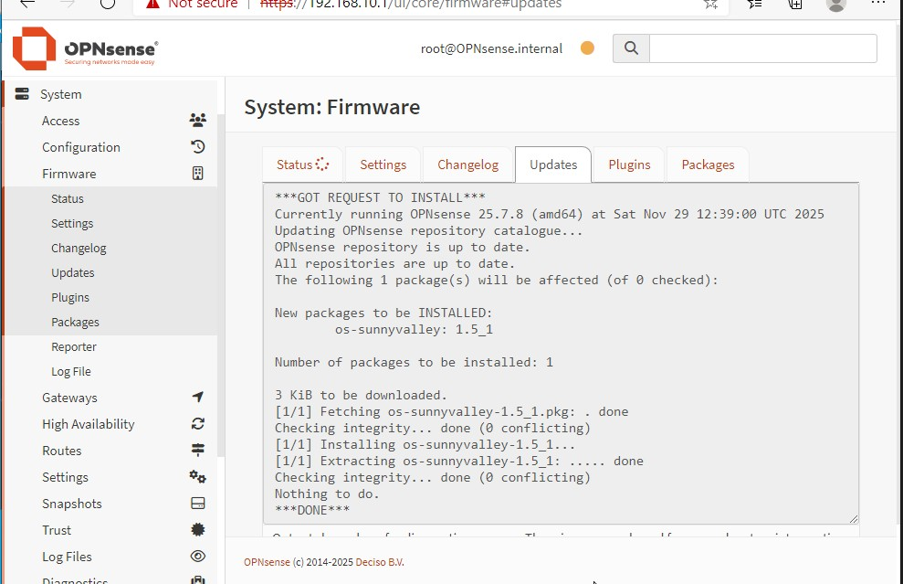
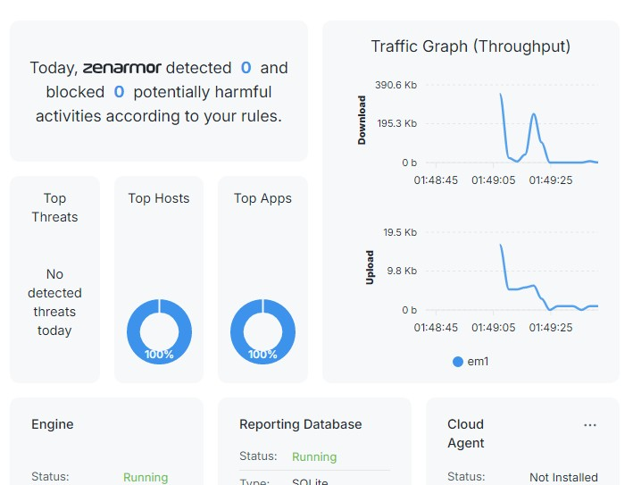
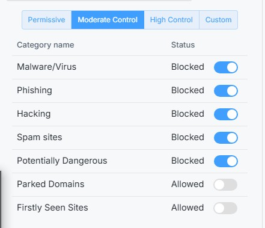
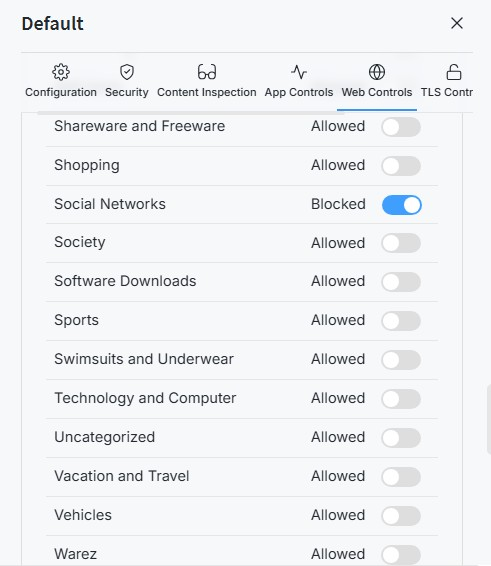
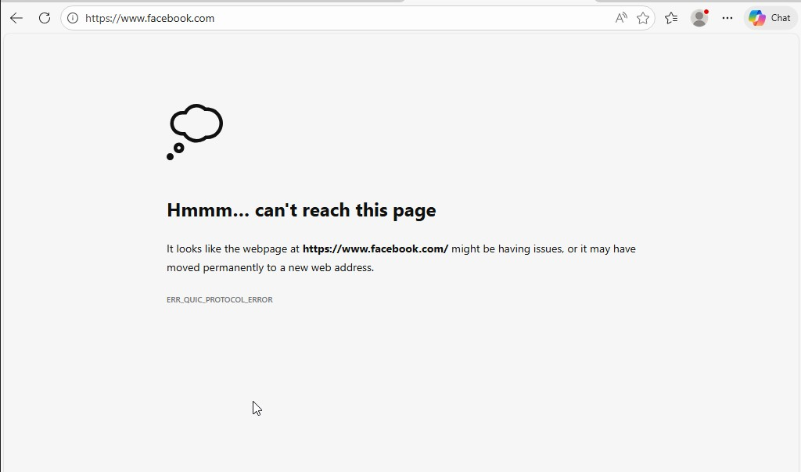

# Phase 3: Perimeter & Defense Hardening

## Executive Summary
This document covers **Phase 3** of the Securinets ENIT enterprise infrastructure project. With the core OPNsense firewall and interfaces already configured, this phase focuses strictly on deploying advanced threat detection and application filtering:

* **Suricata (IDS/IPS):** Deployed on the **WAN** interface for North-South perimeter defense against external threats.
* **Zenarmor (NGFW):** Deployed on the **LAN** interface for Deep Packet Inspection (DPI) and application-level filtering within the Active Directory environment.

The following sections detail the configuration, security rules, and validation tests for both engines.

---
### Deploying Suricata IDS/IPS on OPNsense

In accordance with the Phase 3 objectives of establishing perimeter and defense hardening, the Suricata Intrusion Detection and Prevention System (IDS/IPS) has been deployed and configured on the OPNsense firewall.

#### 1. Architecture and Strategic Placement
To ensure optimal protection of the Active Directory (AD) environment and to accommodate the technical constraints of OPNsense's netmap capture engine, a strict separation of roles was adopted:

* **Suricata** is deployed exclusively on the **WAN** interface. It acts as the first line of perimeter defense (North-South Firewall) to inspect, detect, and block attacks originating from the simulated external network.
* *(Technical Note: Zenarmor will be deployed on the LAN interface for internal application-level analysis, thereby preventing hardware conflicts on the same interface).*

#### 2. Deployment Strategy
The deployment was carried out in two distinct phases to ensure network stability and adhere to best practices:

* **Phase 1 - IDS Mode (Surveillance):** Initially, the service was enabled in detection-only mode (actions set to *Alert*) to establish a traffic baseline and validate the detection of simulated attacks without disrupting connectivity.
* **Phase 2 - IPS Mode (Prevention):** Once the detection phase is validated, the **IPS Mode** will be enabled (actions switched to *Drop*) to actively block identified malicious traffic.

#### 3. Security Policy and Ruleset Selection
A strict filtering policy was implemented by downloading reputable lists and recognized signatures (specifically Emerging Threats and Abuse.ch).


The following categories were activated with specific security objectives:

* **Anti-Reconnaissance (`emerging-scan`, `emerging-dos`):**
  * *Justification:* Blocks network mapping attempts (e.g., Nmap scans) and denial-of-service traffic before a targeted attack can be launched.
* **Active Threat Blocking (`emerging-malware`, `emerging-exploits`):**
  * *Justification:* Prevents the exploitation of known vulnerabilities (especially RPC, SMB, or Kerberos flaws specific to Windows environments) and blocks malware communications to the outside (Command & Control servers).
* **Poor Reputation Lists (`emerging-botcc`, `emerging-drop`, `compromised`):**
  * *Justification:* Systematically rejects any inbound or outbound traffic linked to globally recognized dangerous IP addresses (compromised servers, botnets, spam sources).

#### 4. Security Maintenance (Signature Updates)
To guarantee effective protection against new threats (Zero-Day) and the rapid evolution of attack infrastructures, an automatic signature update task was configured.

* **Frequency:** Updates are scheduled every 12 hours. This allows the Threat Intelligence system to remain highly responsive to recent attack campaigns.

#### 5. Validation and Detection Testing
To validate the correct operation of the IDS engine and the enforcement of the rulesets, a basic attack simulation was conducted.

**Step 1: Executing the Simulation**
The SSH service was temporarily enabled on OPNsense. Once connected via the command line (Option 8 for Shell), the following command was executed to simulate a known malicious behavior:

```bash
curl http://testmynids.org/uid/index.html
```

**Step 2: Validating the Results**
By navigating to the administration interface (**Services > Intrusion Detection > Alerts**), we confirmed that the simulated attack was successfully detected by Suricata on the WAN interface.


The detailed alert information confirms that the `GPL ATTACK_RESPONSE id check returned root` signature was correctly triggered by the simulated HTTP request.


---
###  Deploying Zenarmor NGFW on the Internal Network (LAN)

In accordance with the Phase 3 security requirements for the Active Directory (AD) laboratory and the technical constraints of OPNsense's `netmap` engine, the Zenarmor Next-Generation Firewall (NGFW) has been deployed. It acts as a Deep Packet Inspection (DPI) and application filtering solution.

#### 1. Installation and Initialization
The deployment of Zenarmor was carried out directly from the OPNsense interface:

* **Plugin Installation:** Navigated to **System > Firmware > Plugins** to search for and install the base repository. As confirmed by the installation capture, the deployed version is the **`os-sunnyvalley: 1.5_1`** package.
* **Initial Configuration:** Once installed, the Zenarmor Configuration Wizard was launched to define the baseline parameters for the network architecture and data management.



#### 2. Architecture and Strategic Placement
Unlike the Suricata IDS positioned on the WAN (North-South traffic), Zenarmor was deployed **exclusively on the internal LAN interface, hardware-identified as `em1`**.

* *Strategic Justification:* This placement on the `em1` interface allows for the analysis of decrypted East-West traffic. It provides full visibility into the real IP addresses of the Active Directory domain clients, enabling precise application filtering and granular control of corporate policies without causing hardware conflicts with Suricata.

#### 3. Deployment Parameters and Optimization
During the configuration wizard, the following technical choices were made to align with the laboratory's constraints:

* **Operating Mode:** *Routed Mode (L3 Mode, native netmap).*
  * *Justification:* This mode integrates natively with OPNsense routing. It allows Zenarmor to intercept packets at high speed on `em1` without disrupting the existing AD network topology.
* **Database Engine:** *SQLite.*
  * *Justification:* In a virtualized lab environment hosting a domain controller and clients, optimizing Random Access Memory (RAM) and CPU is critical. SQLite was chosen over Elasticsearch or MongoDB because it offers sufficient robustness to store local logs and telemetry without overloading the hypervisor's resources.



#### 4. Filtering Policy Configuration and AD Integration
To simulate a realistic corporate environment, the filtering policy was configured as follows:

* **Active Directory Integration (Out of Scope):** Although Zenarmor supports granular per-user integration via the *Zenarmor AD Agent*, this feature is considered out of scope for Phase 3. The current filtering relies on the *Default Policy* based on IP addresses and DPI network packet analysis.

Under the **Security**, **App Control**, and **Web Control** tabs of the default policy:
* **Baseline Security:** Categories related to malware, phishing, and botnets are managed within the Essential and Advanced Security layers to ensure a secure baseline.



* **Productivity Rules:** Explicit blocking was applied to the following categories:
  * **Social Networks:** Restriction of platforms such as Facebook, Instagram, X (Twitter), etc.
  * **Gaming:** Blocking of online gaming platforms and associated applications.



#### 5. Traceability, Logs, and Alerts
Incident management and traffic visibility are handled via the centralized Zenarmor interface:

* **Dashboard and Reports:** Security events and bandwidth usage can be viewed directly in the **Zenarmor Dashboard**. Administrators can monitor *Top Threats*, *Top Hosts*, and *Top Apps*.
* **Alerts and Monitoring:** The SQLite engine locally stores blocked connection events (Live Sessions / Reports). The technical team must proactively consult the *Reports* tab to audit attempted access to blocked categories (e.g., Gaming, Social Networks).

#### 6. Security Maintenance (Threat Intelligence)
To ensure proactive protection against recent application-layer threats, phishing campaigns, and malware targeting domain end-users, automatic updates for Zenarmor's *Threat Intelligence* databases were enabled and configured during the initial installation. This allows the NGFW to react to new threats in real-time.

#### 7. Application Filtering Testing and Validation
To validate the effectiveness of the blocking policies applied to the LAN network (`em1`), a connectivity test was performed from a client machine joined to the Active Directory domain.

* **Test Scenario:** Attempted simultaneous access to an authorized email service and a social network blocked by the productivity policy.
* **Result:** Access to **Gmail** was successfully authorized, confirming that legitimate traffic is not impacted. In contrast, the connection to **Facebook** was firmly intercepted and blocked by Zenarmor's DPI engine, demonstrating the effective enforcement of the social network restriction rule.

 